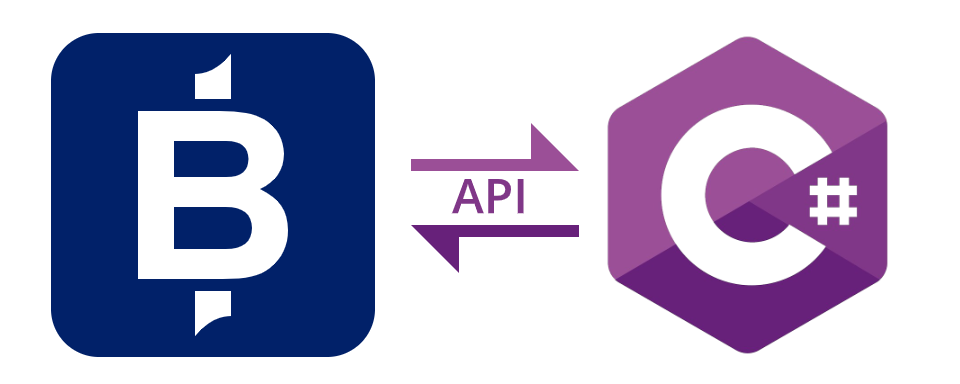

# Public API for .NET

[](https://www.apache.org/licenses/LICENSE-2.0.html)

---

## API Features

The BidFX .NET API is a price API that connects to the BidFX trading platform to subscribe to realtime pricing.
The API supports the following features:

- FX streaming executable prices (RFS)
- FX request for quote (RFQ)
- FX and Futures trading from .NET is available via the REST.

Most users of the API will trade against the received prices.
Trading is achieved by making RESTful requests to post orders via the BidFX REST API.
The REST API is easily accessed using .NET.

## About BidFX

BidFX is the market-leading provider of electronic trading solutions for the global foreign exchange marketplace. BidFX
has addressed the challenges of the FX market by introducing a complete suite of negotiation protocols – which include:
auto-routing, streaming, request-for-quote, voice, algo-trading and best execution – via a cloud-based SaaS trading
platform.
BidFX offer clients access to a cutting edge, broker-neutral, Execution Management System (EMS) backed by a hub to all
major bank's algo suites.
You can read about all BidFX products on the [BidFX Website](https://www.bidfx.com).

## Other APIs

BidFX clients generally access the trading platform via a dedicated User Interface (UI) either on their desktop PC, web
browser or mobile device.
APIs provide a secondary means of accessing the trading platform that can either supplement the UI or replace it
entirely for some use cases, including systematic trading, OMS integration and market intelligence.
BidFX place significant emphasis on API support and therefore provide a suite of APIs for different high-level
programming languages and data exchange protocols.

You can read about the complete BidFX API range, and their different capabilities,
at [BidFX API Overview](https://www.bidfx.com/apis).

## C# API

This document describes the BidFX Public API for .NET.
The .NET API is written in C#.
All of the code examples below are also presented in C#.
To maximise compatability across the potential community of users, we have built the API targetting .NET Standard 2.0.
We use the tag _Public_ to indicated that, this API is designed and maintained for public use by BidFX clients.
Being _public_ implies a degree of support, API stability and future compatibility appropriate to client usage.

### Realtime Price feeds

Liquidity Providers (LPs) mostly publish tradeable price/quotes into the BidFX platform using the FIX protocol. The
quotes from LPs are firm prices with an associated price ID that needs to be attached to any order made against the
quote.
The BidFX platform consumes billions for FIX messages per day.
We provision high-bandwidth, cross-connect circuits in the main global data centres for this purpose.
BidFX cross-connect where most banks host their price engines, in particular in:

- London (LD4),
- New York (NY4)
- Singapore (SG1) and
- Tokyo (TY3).

FX quotes are short-lived and LPs reserve the right of **last look**.
A quote usually is good for no more than a few hundred milliseconds.
Network latency between the client application and the LP is therefore a significant consideration if we want to avoid
rejections.
If clients intend to trade directly against price IDs, then it is recommended that they run their application very close
to the source of liquidity and cross-connect within the same data centre if possible.
Alternatively, clients may route their orders to the BidFX Strategy Server to minimise both rejections and slippage.

The BidFX .NET API implements a highly optimised, bespoke binary protocol to deliver realtime quotes from LPs directly
to into a client's application with minimal latency.
The binary delivery mechanism is approximately 80 times more efficient than the FIX protocol.
Furthermore, using the publish and subscribe paradigm, BidFX servers publish only those quotes that are subscribed to.

## API Set Up

### Git Repository

As part of the BidFX Open Source initiative, we have published the source code for the BidFX C# API on
the [BidFX Github Page](https://github.com/bidfx).
You can clone the API with the following command.

```shell
git clone https://github.com/bidfx/bidfx-api-dotnet.git
```

### Configuring your IDE

For C# development we recommend an integrated development environment (IDE) designed for programming in C#.
We use the **Rider** IDE from JetBrains. You can configure Rider as follows.

# API Usage

The Price API makes use of a publish-subscribe paradigm in which clients register for price updates by subscribing on
subjects.
Subjects identify individual products or instruments for which realtime pricing may be obtained.
Liquidity providers publish streams of realtime prices against large numbers of subjects.
The BidFX price service matches the client's subscribed subjects against the total universe of published subjects and
forwards on to each client only those price updates that match their subscriptions.

The namespace `BidFX.Public.API.Price` contains all of the classes, methods and event handlers that are necessary to
subscribe to pricing from several pricing services.
The common usage patten for the API involves:

- Creating a connection to BidFX's externally accessible pricing service.
- Subscribe to subjects representing instruments from multiple price providers.
- Receive status and realtime price updates on each subscription.
- Unsubscribe from price subjects to stop receiving updates.

## Creating a Session

When using the API the main class you create is called a `Client` although you will not normally use this class
directly.
Since most applications use only a single 'Client', they usually get access to it via the
singleton `BidFX.Public.API.DefaultClient`.

```csharp
var client = BidFX.Public.API.DefaultClient.Client
client.Host = "api.ld.bidfx.biz";
client.Username = "myusername";
client.Password = "mysecretpassword!";
client.ProductSerial = "f2d332674ddfe0b02833979c";
```

It doesn't matter what order you configure your details, but do ensure
you set all those fields listed in the following table:

| Name                | Description                                                                                             | Type           |
|---------------------|---------------------------------------------------------------------------------------------------------|----------------|
| Host                | The hostname of the BidFX [POP](POP.md). The host determines the environment.                           | std::string    |
| Username            | The username to authenticate with. Must be a valid API user for the environment.                        | std::string    |
| Password            | The password of the selected user.                                                                      | std::string    |
| ProductSerialNumber | The serial number assigned by BidFX for the product. Used for product licensing purposes.               | std::string    |

## Pricing

## Get the Price Manager

Once you have created you `Client` with the correct properties, you can then get the price session and the price
subscriber like so:

```csharp
var priceSession = client.PriceSession;
var priceSubscriber = client.PriceSubscriber;
```

This will initiate the connection to the price services and await subscriptions from you.
If you encounter an error at this point then this is most likely a result of a mis-configuration of one of more of the
above properties.

### Registering for Price Updates from Subscriptions

Real-time price updates are forwarded to the client application via the standard .NET event pattern. To register for
price updates, you create a callback method (event delegate) to handle the published events. The method signature should
be as follows:

```csharp
void OnPriceUpdate(object source, PriceUpdateEvent priceEvent)
```

You then associate your callback with the event mechanism by adding it to the session's field-like event
handler `PriceUpdateEventHandler`. For example:

```csharp
// Define an event delegate for handling price update events.
private void OnPriceUpdate(object source, PriceUpdateEvent priceEvent)
{
    IPriceMap price = priceEvent.AllPriceFields;
    decimal bid = price.DecimalField(FieldName.Bid) ?? 0.0m;
    decimal ask = price.DecimalField(FieldName.Ask) ?? 0.0m;
    Console.WriteLine(priceEvent.Subject + " bid=" + bid + " ask=" + ask);
}
 
// Register the callback with the session's price update event mechanism.
priceSession.PriceUpdateEventHandler += OnPriceUpdate;
 
// If required, later de-register the callback from the session's price update event mechanism.
priceSession.PriceUpdateEventHandler -= OnPriceUpdate;
```

### Registering for Status Updates from Subscriptions

If the price service cannot provide a price for a subject for some reason, it will publish a subscription status event
against the problem subject.
Again the standard .NET event pattern is employed to manage these events.
To register for status updates, you create a callback method (event delegate) to handle the event.
The method signature should be as follows:

```csharp
void OnSubscriptionStatus(object source, SubscriptionStatusEvent statusEvent)
```

You then associate your callback with the event mechanism by adding it to the session's field-like event handler
SubscriptionStatusEventHandler.
We recommend that all applications register for subscription status events.
You can also unsubscribe from status updates if you are so inclined.
For example:

```csharp
// Define an event delegate for handling status updates.
private void OnSubscriptionStatus(object source, SubscriptionStatusEvent statusEvent)
{
    Console.WriteLine(subscriptionStatusEvent.Subject + " " + subscriptionStatusEvent.Status + " - " + statusEvent.Reason);
}

// Register for status updates.
priceSession.SubscriptionStatusEventHandler += OnSubscriptionStatus;

// If required, later de-register from status updates.
priceSession.SubscriptionStatusEventHandler -= OnSubscriptionStatus;
```

### Check if the Pricing Connections are Ready

To check if the session is ready for use, use the Ready property of the ISession.

```csharp
if (priceSession.Ready) {
    // the session is ready
}
else
{
    // the session is not ready
}
```

### Wait for the Pricing Connections to be Ready

It is not necessary to wait until the pricing connections are ready before making subscriptions but some applications
need this capability.
Should you wish to wait until the pricing connections are ready, then you can call the method `WaitUntilReady` on the
price session.
This method takes a `System.TimeSpan` as a timeout interval.
If the pricing connections become ready within the given time interval then the method returns true.
If the pricing connections are still not ready by the end of the time interval then it returns false.
In the latter case you might then take the opportunity to output the status of each connection - accessible
via `ProviderProperties` - to find out why that connection failed to ready itself.

For example:

```csharp
if (priceSession.WaitUntilReady(TimeSpan.FromSeconds(30)))
{
    // pricing session is ready for subscriptions
}
else
{
    if (priceSession.ProviderProperties().Any(pp => ProviderStatus.Unauthorized == pp.ProviderStatus)
    {
        // invalid credentials
    }
    priceSession.stop();
}
```

### Creating a Subject

A `BidFX.Public.API.Subject.Subject` is immutable and therefore cannot be edited once created - we have therefore
provided a builder class (`BidFX.Public.API.Subject.SubjecBuilder`) to allow for easy subject creation.
We have provided static helper methods in `BidFX.Public.API.Subject.CommonSubjects` to help create some likely subjects.
Common component values are provided as string constants in `BidFX.Public.API.Price.Subject.CommonComponents` to help
reduce typing errors.

Below are some examples on how to create subjects in different ways:

```csharp
var spotStreamingSubject = CommonSubjects.CreateLevelOneSpotStreamingSubject("My_Account", "EURUSD", "UBSFX", "EUR", "1000000.00");
var ndfQuoteSubject = CommonSubjects.CreateLevelOneNdfQuoteSubject("My_Account", "USDKRW", "UBSFX", "USD", "1000000.00", "", "20170707");
var spotDepthSubject = CommonSubjects.CreateLevelTwoSpotStreamingSubject("My_Account", "EURUSD", "USD", "1000000.00");
var indicativeSubject = CommonSubjects.CreateIndicativePriceSubject("EURUSD");

// To create your own from scratch yourself you can do so like this:
new SubjectBuilder()
    .SetComponent(SubjectComponentName.AssetClass, CommonComponents.Fx)
    .SetComponent(SubjectComponentName.Level, "1")
    .SetComponent(SubjectComponentName.LiquidityProvider, "Indi")
    .SetComponent(SubjectComponentName.CcyPair, "EURUSD")
    .CreateSubject();
```

When creating a **Premium FX** stream the following fields can be used:

| Name               | Type    | Description                                                    | Required | Example Value  |
|--------------------|---------|----------------------------------------------------------------|----------|----------------|
| CcyPair            | string  | The currency pair                                              | Y        | "EURUSD"       |
| Tiered             | Boolean | Whether to return multiple levels tiered on Quantity           | Y        | False          |
| CrossCurrencyPairs | Boolean | Whether to cross the currency pairs for non USD currency pairs | Y        | False          |

When creating an **Indicative** price stream the following fields can be used:

| Name      | Type   | Description                                           | Required | Example Value |
|-----------|--------|-------------------------------------------------------|----------|---------------|
| CcyPair   | string | The currency pair                                     | Y        | "EURUSD"      |   
| FieldName | string | The field to be displayed from the price subscription | Y        | "Bid"         |

#### Required Fields and Values

##### All deal types

| Field                | Value                                            | Notes                                                                                                                             |
|----------------------|--------------------------------------------------|-----------------------------------------------------------------------------------------------------------------------------------|
| `BuySideAccount`     |                                                  | Either a `BuySideAccount` (your account with BidFX to attach to the order) or the name of an AllocationTemplate must be specified |
| `AllocationTemplate` |                                                  |                                                                                                                                   |
| `AssetClass`         | `Fx`                                             |                                                                                                                                   |
| `Currency`           |                                                  |                                                                                                                                   |
| `Quantity`           |                                                  | Also AllocQuantity for each BuySideAllocAccount specified                                                                         |
| `RequestFor`         | `Stream` or `Quote`                              |                                                                                                                                   |
| `LiquidityProvider`  |                                                  | If Level 2 then `FXTS`. For Indicative pricing, use `Indi` and for Premium FX pricing, use `PremiumFX`                            |
| `DealType`           | `Spot`, `Swap`, `Outright`, `NDS`, or `NDF`      |                                                                                                                                   |
| `CcyPair`            |                                                  |                                                                                                                                   |
| `Tenor`              | `Spot`, `1W`, `2W`, `1M`, `2M`, `1Y`, `2Y`, etc. | User can send `Tenor` or `SettlementDate` to same effect. If sending both, the `SettlementDate` will take precedence              |
| `SettlementDate`     | `YYYYMMDD`                                       |                                                                                                                                   |
| `Level`              | 1 or 2                                           |                                                                                                                                   |
| `NumAllocs`          |                                                  | If any `BuySideAllocAccount` specified                                                                                            |

##### Swap

| Field               | Value                                    | Notes                                                            |
|---------------------|------------------------------------------|------------------------------------------------------------------|
| `FarTenor`          | `1W`, `2W`, `1M`, `2M`, `1Y`, `2Y`, etc. | User can sent `FarTenor` or `FarSettlementDate`                  |
| `FarSettlementDate` | `YYYYMMDD`                               |                                                                  |
| `FarCurrency`       |                                          | Should be the same as `Currency`                                 | 
| `FarQuantity`       |                                          | Also `FarAllocQuantity` for each `BuySideAllocAccount` specified | 

##### NDS

| Field               | Value                                    | Notes                                                            |
|---------------------|------------------------------------------|------------------------------------------------------------------|
| `FarTenor`          | `1W`, `2W`, `1M`, `2M`, `1Y`, `2Y`, etc. | User can sent `FarTenor` or `FarSettlementDate`                  |
| `FarSettlementDate` | `YYYYMMDD`                               |                                                                  |

##### Valid Tenors

| Tenor       |
|-------------|
| `TOD`       |
| `TOM`       |
| `SPOT`      |
| `SPOT_NEXT` |
| `1W`        |
| `2W`        |
| `3W`        |
| `1M`        |
| `2M`        |
| `3M`        |
| `4M`        |
| `5M`        |
| `6M`        |
| `7M`        |
| `8M`        |
| `9M`        |
| `10M`       |
| `11M`       |
| `1Y`        |
| `2Y`        |
| `3Y`        |
| `BD`        |
| `IMMH`      |
| `IMMM`      |
| `IMMU`      |
| `IMMZ`      |

### Subscribing and Unsubscribing

To subscribe or unsubscribe from prices you can call the `Subscribe` or `Unsubscribe` methods of the price subscriber.
These both accept a `BidFX.Public.API.Subject.Subject` to operate on.

```csharp
var subject = new BidFX.Public.API.Subject.Subject("Level=1,LiquidityProvider=CITIFX,Symbol=EURUSD,Currency=EUR,DealType=Spot");

// Subscribe to the subject.
priceSubscriber.Subscribe(subject);

// Unsubscribe to the subject.
priceSubscriber.Unsubscribe(subject);
```

Subscriptions are made asynchronously in the background. The `Subscribe` method will provide no immediate feedback on
the success of otherwise of its action. The client will however quickly receive feedback on the subscription via one of
the event delegate callback methods. If there is a problem then you will receive a `SubscriptionStatus` event. If a
price was obtained then you will receive a `PriceUpdate` event. Price updates have an implied status
of `SubscriptionStatus.OK`. Note that it is not uncommon for some price feeds to initially
publish `SubscriptionStatus.PENDING`, to notify the receipt of a subscription, soon followed by a price update once the
data becomes available from its own remote feed.

Subscribe has an optional argument, `autoRefresh`. Setting this to `True` will cause the subscription to automatically
resubscribe if the subscription is closed without `Unsubscribe` being called on the subject, such as a `Quote`
subscription expiring.

### Price Update Events

Upon receiving a price update in the form of `PriceUpdateEvent`, you'll want to access the data inside of it. There are
three properties:

- A `Subject` called `Subject` equal to the subject passed to `Subscribe`, indicating the instrument you have received
  an update for.
- An `IPriceMap` called `AllPriceFields` containing all current price fields for the instrument.
- An `IPriceMap` called `ChangedPriceFields` containing only those fields which changed in this most recent update.

The `ChangedPriceFields` are always a subset of `AllPriceFields` and in some cases, such as the initial snapshot, they
are identical.
Often GUI applications make use of the `ChangedPriceFields` to flash the fields that have just updated.

#### Price Maps

The interface `BidFX.Public.API.Price.IPriceMap`, as the name suggests, provides a map of price fields stored as
name-value pairs.
With an `IPriceMap` you can enumerate over either all the field names in the map or all of the name-value pairs.
You can also directly access individual fields by their name.
Field names are just strings with short camel-case word list.
All of the likely published field names are defined as string constants in the class
called `BidFX.Public.API.Price.FieldName`.
To avoid simple typing errors you should use these constants for accessing specific fields from the `IPriceMap`.
For example:

```csharp
// Your event delegate for price updates
private void OnPriceUpdate(object source, PriceUpdateEvent priceEvent)
{
    // You can get either AllPriceFields or ChangedPriceFields - for the purpose of this example I will get AllPriceFields
    IPriceMap price = priceEvent.AllPriceFields;
     
    // To enumerate over all the field names as strings you can call:
    IEnumerable<string> allFieldNames = price.FieldNames;
  
    // To enumerate over all key-pairs you can call:
    IEnumerable<KeyValuePair<string, IPriceField>> allPriceFields = price.PriceFields;
  
    // To access a specific field you can call:
    IPriceField bid = price.Field(FieldName.Bid); // the result may be null if the field is absent
  
    // We also include convenience methods for accessing fields of a known type, for example
    decimal? ask = price.DecimalField(FieldName.Ask);
    long? askSize = price.LongField(FieldName.AskSize);
    int? numAsks = price.IntField(FieldName.NumAsks);
    string name = price.StringField(FieldName.Name);
    DateTime? bidTime = price.DateTimeField(FieldName.BidTime);
}
```

#### Field Names

The table below defines some of the more common field names that can be returned from a subscription.
These are defined as string constants in the class called `BidFX.Public.API.Price.FieldName` for convenience.

| FieldName       | Stream & Quote | Depth | Indicative | PremiumFX |
|-----------------|----------------|-------|------------|-----------|
| `Bid`           | X              |       | X          | X         |
| `Bid1`          |                | X     |            | X         |
| `Bid2`          |                | X     |            | X         |
| `Bidn`          |                | X     |            | X         |
| `Ask`           | X              |       | X          | X         |
| `Ask1`          |                | X     |            | X         |
| `Ask2`          |                | X     |            | X         |
| `Askn`          |                | X     |            | X         |
| `BidFirm1`      |                | X     |            |           |
| `BidFirm2`      |                | X     |            |           |
| `BidFirmn`      |                | X     |            |           |
| `AskFirm1`      |                | X     |            |           |
| `AskFirm2`      |                | X     |            |           |
| `AskFirmn`      |                | X     |            |           |
| `BidTime1`      |                | X     |            |           |
| `BidTime2`      |                | X     |            |           |
| `BidTimen`      |                | X     |            |           |
| `AskTime1`      |                | X     |            |           |
| `AskTime2`      |                | X     |            |           |
| `AskTimen`      |                | X     |            |           |
| `BidLevels`     |                | X     |            |           |
| `AskLevels`     |                | X     |            |           |
| `OriginTime`    | X              |       |            |           |
| `PriceID`       | X              |       |            |           |
| `BidSpot`       | X              |       |            |           |
| `AskSpot`       | X              |       |            |           |
| `HopLatency1`   | X              |       |            |           |
| `HopLatency2`   | X              |       |            |           |
| `SystemTime`    | X              |       | X          | X         |
| `High`          |                |       | X          |           |
| `Low`           |                |       | X          |           |
| `Broker`        |                |       | X          |           |
| `PercentChange` |                |       | X          |           |
| `LastTick`      |                |       | X          |           |
| `Open`          |                |       | X          |           |
| `Close`         |                |       | X          |           |
| `Provider`      |                |       | X          |           |
| `NetChange`     |                |       | X          |           |
| `Status`        |                |       | X          | X         |
| `Category1`     |                |       |            | X         |
| `Category2`     |                |       |            | X         |
| `Categoryn`     |                |       |            | X         |

#### Time Fields

Time fields returned from a depth subscription are `Decimal` fields.
Their value is an integer representing the number of milliseconds since the Unix epoch (Java Time).
We have provided a helper method, `BidFX.Public.API.Price.Tools.TimeFieldTools.ToDateTime(decimal timeValue)` to convert
this value into a DateTime object.

### Subscription Status Events

Upon receiving a status update in the form of a SubscriptionStatusEvent, you'll want to access the data inside of it.
There are three properties:

- A `Subject` called `Subject` gives the subject of the subscription the status update refers to.
- A `SubscriptionStatus` containing an enum value that defines the status of the subscription.
- A string containing a more detailed reason of the change in status.

The data can be accessed as follows:

```csharp
// Your event delegate for subscription status events
private void OnStatusUpdate(object source, SubscriptionStatusEvent statusEvent)
{  
  Subject subject = statusEvent.Subject;
  SubscriptionStatus status = statusEvent.SubscriptionStatus;
  string reason = statusEvent.StatusReason;
}
```

Most subscription status' result from temporary issues that can be resolved by the price service. For example, if a
connection goes down and fails over then the API will publish a recoverable status code such
as `SubscriptionStatus.STALE` and then quickly reconnect and resume publishing prices again.

Other status codes are more serious and tend to be semi-permanent in nature; examples are, bad symbols, invalid price
source, user authentication or authorisation error. These are normally unrecoverable without some admin user
intervention followed by re-subscribing. That said, in a long running application we need every type of error the be
potentially recoverable in time without the need to restart the application. So if a subscription comes back with a
server status code, such as the liquidity provider's remote feed not running, the API will automatically resubscribe
periodically in an attempt to recover. This re-subscription interval is, by default, a relatively long 5 minutes to
prevent overly stressing the server with bad subscriptions. The time interval can however be configured if required by
setting the session property `SubscriptionRefreshInterval`.

### Connection Status Events

When the price session is started it will create and start connections to each of it's providing services. Each service
connection will be initially in a down state with the status `ProviderStatus.TemporarilyDown`. As connections come
online or go offline they send status updates in the form of `ProviderStatusEvents`. Clients can register callbacks to
receive notification of these events.

```csharp
// define a callback for handling ProviderStatusEvents
private static void OnProviderStatus(object sender, ProviderStatusEvent providerStatusEvent)
{
  Log.Info("provider status: " +
    providerStatusEvent.Name + " changed status from " +
    providerStatusEvent.PreviousProviderStatus
    + " to " + providerStatusEvent.ProviderStatus
    + " because: " + providerStatusEvent.StatusReason);
  }

// register callback with the Pisa session
priceSession.ProviderStatusEventHandler += OnProviderStatus;
```

### Accessing provider properties

It is possible to access the current properties of each provider by calling `ProviderProperties` on the price session.
This gives the current status of each provider. For example:

```csharp
ICollection<IProviderProperties> providerProperties = priceSession.ProviderProperties();
foreach (var providerProperties in providerProperties)
{
    Log.Info(providerProperties.Name + " is " + providerProperties.ProviderStatus);
}
```

### Stop the price session

When you are finished with the pricing session you should stop the session to free up its resources by calling `Stop`.
For
example:

```csharp
// Stop the session.
BidFX.Public.API.DefaultClient.Client.PriceSession.Stop();
```

## Trading

### Get the Trade Manager

Once you have created your `Client` with the correct properties, you can get the trade manager which is able to submit
and query orders.

```csharp
var tradeSession = client.TradeSession;
```

The Trade manager has the following workflow:

1. User registers an event handler to `TradeSession.OrderSubmitEventHandler`.
2. User creates an `FxOrder` object, using an `FxOrderBuilder`.
3. User submits the order using `TradeSession.SubmitOrder()`. This returns a locally-unique MessageId. The order
   submission to the BidFX system is done asynchonously, so you can have multiple messages in-flight at once.
4. The TradeSession receives a response from BidFX for the order and notifies the event handlers.
5. The user can determine which message the callback invocation is for by checking the `MessageId` of
   the `OrderResponse` passed to it.

### Order Fields

These are all of the order fields that can be set in FxOrderBuilder.
Each of these fields can be set via their corresponding Set method.
For example

```csharp 
FxOrder fxOrder = new FxOrderBuilder()
    .SetAccount("FX_ACCT")
    .SetCurrencyPair("EURGBP")
    .SetCurrency("GBP")
    .SetDealType("Spot")
    .SetHandlingType("stream")
    .SetPriceType("Limit")
    .SetPrice("1.180000")
    .SetQuantity("2000000")
    .SetSide("Sell")
    .SetSettlementDate("2018-02-07")
    .SetReferenceOne(".NET API Example")
    .Build();
```

| Field Name            | Field Type | Example Data | FX Order Type | Notes                                                                                                                   |
|-----------------------|------------|--------------|---------------|-------------------------------------------------------------------------------------------------------------------------|
| `Account`             | String     | "FX_ACCT"    | Any           | The account to book the order to.                                                                                       |
| `AllocationTemplate`  | String     |              | Any           | The name of a pre-trade allocation template to assign to the order.                                                     |
| `Currency`            | String     | "GBP"        | Any           | The dealt currency, must match either the base or term from the given currency pair.                                    |
| `CurrencyPair`        | String     | "EURGBP"     | Any           | The currency pair being traded.                                                                                         |
| `DealType`            | String     | "Spot"       | Any           | The deal type to be traded.                                                                                             |	
| `FarCurrency`         | String     | "GBP"        | Swap and NDS  | The dealt currency of the far leg of a swap order.                                                                      |
| `FarFixingDate`       | String     | "2020-01-01" | NDS           | The fixing date of the far leg of a swap order in the format `YYYY-MM-DD`.                                              |
| `FarQuantity`         | String     | "10000000"   | Swap and NDS  | The dealt quantity of the far leg of a swap.                                                                            |
| `FarSettlementDate`   | String     | "2020-01-01" | Swap and NDS  | The settlement date of the far leg of a swap in the format `YYYY-MM-DD`.                                                |
| `FarTenor`            | String     | "2M"         | Swap and NDS  | The tenor of the far leg of a swap order.                                                                               |
| `FixingDate`          | String     | "2020-01-01" | NDF and NDS   | The fixing date in the format `YYYY-MM-DD`.                                                                             |
| `HandlingType`        | String     | "Stream"     | Any           | The handling type of the order, see table below for supported types.                                                    |
| `Price`               | String     | "1.34586"    | Any           | The price of the order. For an algo this could be the limit or stop price. For a market order the price can be omitted. |
| `Quantity`            | String     | "10000000"   | Any           | The dealt quantity to be traded. Specific in terms of the dealt_ccy.                                                    |
| `ReferenceOne`        | String     |              | Any           | STP reference. Valid values vary and if in doubt, please ask your account manager.                                      |
| `ReferenceTwo`        | String     |              | Any           | STP reference. Valid values vary and if in doubt, please ask your account manager.                                      |
| `SettlementDate`      | String     | "2018-01-30" | Any           | The settlement date in the format "YYYY-MM-DD".                                                                         |
| `Side`                | String     | "Buy"        | Any           | The side of the order.                                                                                                  |         
| `Tenor`               | String     | "1M"         | Any           | The tenor of the order.                                                                                                 |       

#### Notes

- An order must contain either a tenor or settlement date.
- Orders resulting from "request for stream/quote" workflow need to return the last price received from the LP that the
  order is being routed to.

### Supported Deal Types

| Deal Type  | Description                            |
|------------|----------------------------------------|
| `Spot`     | For a spot order                       |
| `Forward`  | For a forward outright order           |
| `Outright` | For a forward outright order           |
| `Swap`     | For a swap order                       |
| `NDF`      | For a non-deliverable forward outright |
| `NDS`      | For a non-deliverable swap order       |

### Supported Handling Types

| Handling Type | Description                             |
|---------------|-----------------------------------------|
| `Stream`      | Used in request for stream workflow     |
| `Quote`       | Used in request for quote workflow      |
| `Automatic`   | Used for sending an order to bank algos |

### Supported Price Types

| Price Type |
|------------|
| `Limit`    |
| `Market`   |
| `Quoted`   |

## Registering for Message Responses

New order submissions and order queries are sent to the server asynchronously, and the response is delivered as a
callback to the OrderSubmitEventHandler and OrderQueryEventHandler event handlers. These operate in the standard .NET
event pattern.

A callback method (event delegate) should have the following method signature, for both OrderSubmit events and
OrderQuery events:

```csharp
void MethodName(object source, OrderResponse orderResponse)
```

You then associate your callback with the event mechanism by adding it to the session's field-like event handler
PriceUpdateEventHandler. For example:

```csharp
// Define event delegates for handling order response events.
private void OnOrderSubmitResponse(object source, OrderResponse orderResponse)
{
    long messageId = orderResponse.GetMessageId();
    string tsOrderId = orderResponse.GetOrderId();
    string state = orderResponse.GetState();
     
    //Do something...
}
  
private void OnOrderQueryResponse(object source, OrderResponse orderResponse)
{
    long messageId = orderResponse.GetMessageId();
    string tsOrderId = orderResponse.GetOrderId();
    string state = orderResponse.GetState();
 
    //Do something...
}
  
// Register the callbacks with the session's event mechanism.
tradeSession.OrderSubmitEventHandler += OnOrderSubmitResponse;
tradeSession.OrderQueryEventHandler += OnOrderQueryResponse;
  
// If required, later de-register the callbacks from the session's event mechanism.
tradeSession.OrderSubmitEventHandler -= OnOrderSubmitResponse;
tradeSession.OrderQueryEventHandler -= OnOrderQueryResponse;
```

## Logging

The API makes use of the logging framework [Serilog](https://serilog.net) for logging important activity and errors. As
a guide we log high volume messages, such as price ticks, at **debug** level so they are easily disabled via
configuration. Server connection attempts are logged at **info** level, as are subscriptions. Connections failures are
logged at **warn** level. All log messages from the API have the `SourceContext` property set to their namespace &
class.

We suggest setting the log level to **info** in a production system to keep the level of logging manageable. If you
choose to enable debug logging in production then there will be a performance impact when prices update quickly.

Serilog requires the use of _sink_ packages in order to have somewhere to log to. For example, by using
the `Serilog.Sinks.Console` package, we can log to the console with the following configuration:

```csharp
Log.Logger = new LoggerConfiguration()
                    .MinimumLevel.Debug()
                    .WriteTo.Console(outputTemplate:
                        "[{Timestamp:HH:mm:ss} {Level:u4}][{SourceContext}] {Message:lj}{NewLine}{Exception}")
                    .CreateLogger();
```

